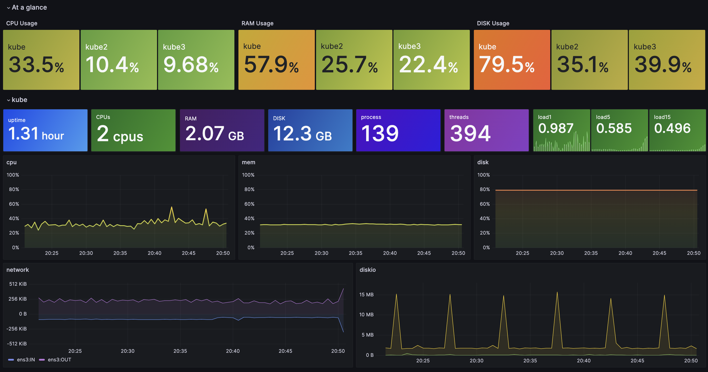
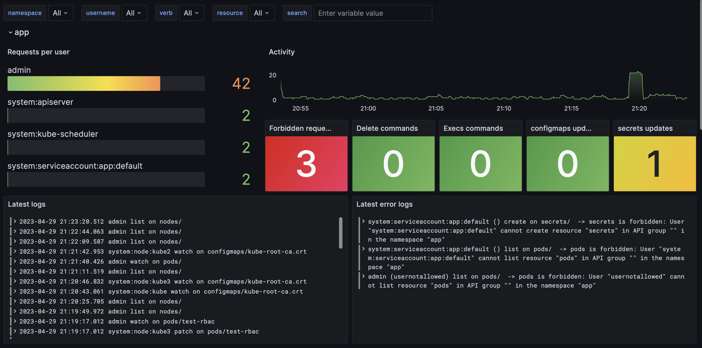
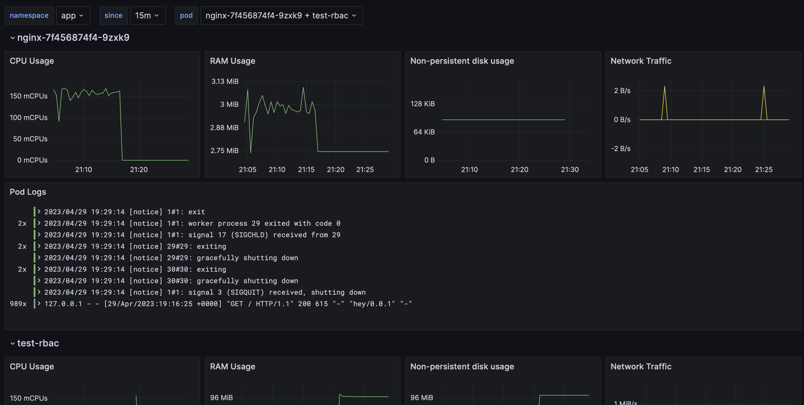

# k8s-watchtower


A minimal k8s observability stack which includes: 
- host level & kubernetes metrics
  
- RBAC audit log monitoring
  
- central application logs aggregation
  

## Components:

- `promtail` for log application logs & k8s audit log aggregation
- `telegraf` for node-level monitoring & kubernetes level metrics
- `influx` & `loki` for storing metrics and logs 
- `grafana` for the dashboarding


## Deployment

You'll need at least `helm` installed. You can refer to [this section](#enabling-the-audit-log) if you want to enable the audit log beforehand.

Add the repo to helm and get the default values.yaml file
```
helm repo add watchtower https://k0rventen.github.io/k8s-watchtower/
helm show values watchtower/watchtower > defaults.yaml
```
Review and modify if necessary the values according to your setup (mainly for the audit Log file part)


Then deploy (preferably in a separate namespace):
```
helm upgrade --install --namespace watchtower --create-namespace watchtower -f defaults.yaml watchtower/watchtower
```

Once deployed, port-forward the `grafana` service to your machine
```
kubectl port-forward -n watchtower svc/watchtower-grafana 3000
```

then access the dashboards at `http://localhost:3000`.


### Enabling the Audit Log

Add the following arguments to the APIserver config:

```
--audit-log-maxbackup=3
--audit-log-maxsize=1024
--audit-log-maxage=30
--audit-policy-file=/etc/kubernetes/kube-api-audit-policy.yaml
--audit-log-path=/var/log/k8s-apiserver-audit.log
```


Create a new file at the path you specified in the `audit-policy-file` argument, which defines your audit policy:
```
apiVersion: audit.k8s.io/v1
kind: Policy
omitStages:
  - "RequestReceived"
  - "ResponseStarted"
rules:
- level: Metadata
  namespaces: ["app","app2"]
```

In this example we ask the cluster to log every request at the metadata level, in namespaces `app` and `app2`. If you don't specify `namespaces`, all namespaces will be audited. 

You can refer to https://kubernetes.io/docs/tasks/debug/debug-cluster/audit/ if you want further tweaks.
